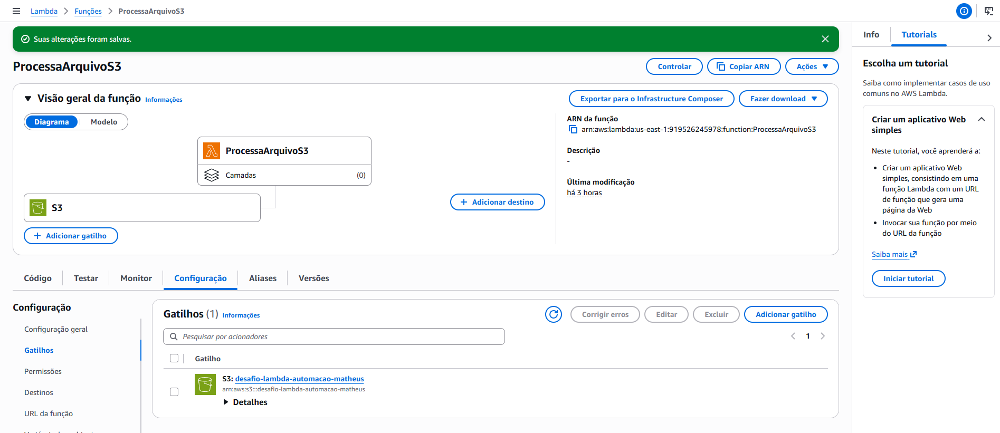
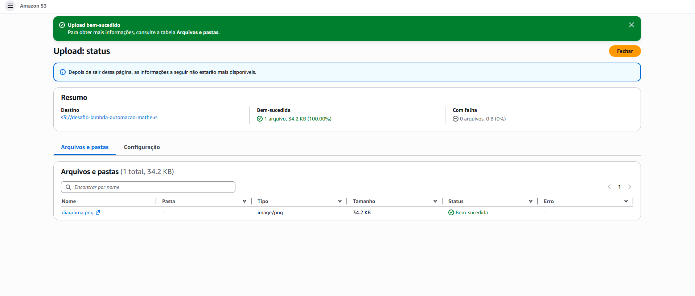
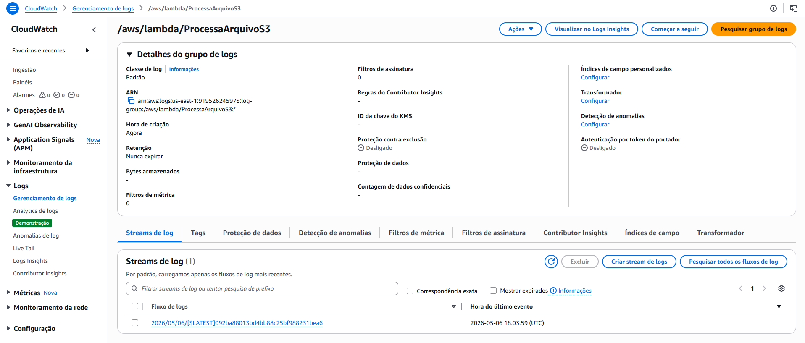

# 🚀 Executando Tarefas Automatizadas com AWS Lambda e S3

Este projeto demonstra a implementação de uma arquitetura **Serverless** orientada a eventos. O objetivo principal é automatizar o processamento de dados sempre que um novo arquivo é carregado em um bucket do **Amazon S3**, disparando uma função **AWS Lambda** de forma imediata.

## 📋 Fluxo do Projeto

1.  **Armazenamento**: Um arquivo é carregado no Amazon S3.
2.  **Evento**: O S3 detecta o upload e dispara um gatilho (trigger).
3.  **Processamento**: A função AWS Lambda é invocada automaticamente.
4.  **Logging**: O resultado da execução é registrado no Amazon CloudWatch.

---

## 🛠️ Implementação Passo a Passo

### 1. Configuração da Função Lambda
A função foi criada utilizando o runtime **Python**. Ela foi programada para extrair o nome do bucket e o nome do arquivo carregado a partir do objeto `event` recebido do S3.

### 2. Configuração do Gatilho (Trigger)
Para conectar os serviços, configuramos um gatilho de S3 dentro da interface do Lambda. Esta conexão permite que o Lambda "escute" as atividades do bucket em tempo real.

*Legenda: Interface do AWS Lambda mostrando a conexão estabelecida com o gatilho S3.*

---

### 3. Teste de Upload no S3
Para validar a automação, realizamos o upload de um arquivo para o bucket de destino. Neste momento, o sistema dispara a função de forma transparente.

*Legenda: Confirmação de upload bem-sucedido no Amazon S3, acionando o fluxo de automação.*

---

### 4. Monitoramento e Logs (CloudWatch)
A prova real da execução ocorre no **Amazon CloudWatch**. Lá, verificamos os logs gerados pela função Lambda, confirmando que ela processou os dados do evento corretamente.

*Legenda: Grupo de logs no CloudWatch evidenciando a execução da função e o rastreamento do evento.*

---

## 💡 Insights e Aprendizados

*   **Arquitetura Orientada a Eventos**: Este projeto demonstra como eliminar o processamento ocioso. A função só roda (e só custa) quando há um evento real.
*   **Troubleshooting e Persistência**: Durante o desenvolvimento, foi necessário lidar com a recriação de recursos, o que reforçou o aprendizado sobre a reconfiguração de gatilhos e permissões de IAM.
*   **Escalabilidade**: Como a solução é serverless, ela escala automaticamente, processando um ou mil uploads simultâneos sem necessidade de gerenciar servidores.

## ⚙️ Tecnologias Utilizadas

*   **Amazon S3**: Armazenamento de objetos.
*   **AWS Lambda**: Computação serverless.
*   **Amazon CloudWatch**: Monitoramento e logs.
*   **Python**: Linguagem utilizada para a lógica da função.

---

**Desenvolvido como parte do desafio técnico na DIO.**
